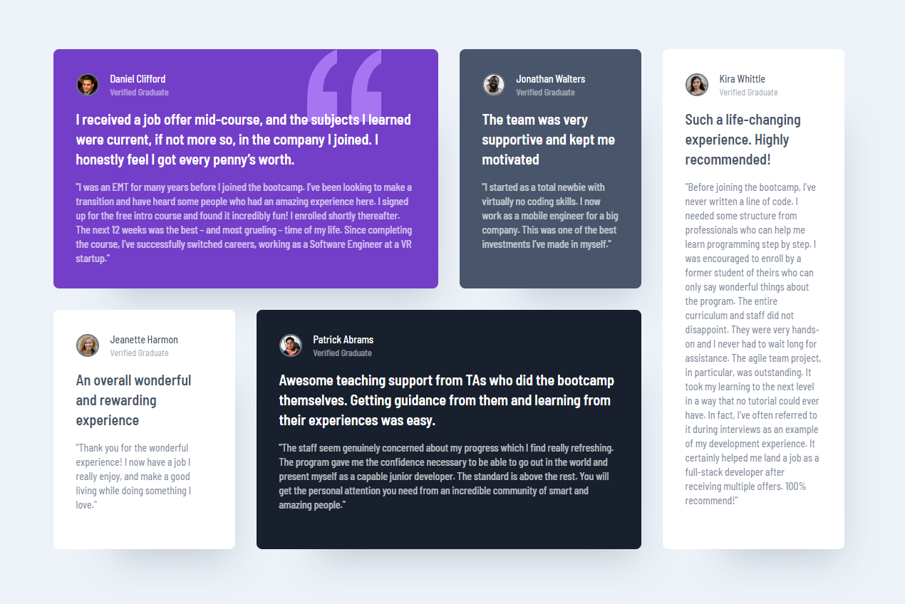

# Frontend Mentor - Testimonials grid section solution

This is a solution to the [Testimonials grid section challenge on Frontend Mentor](https://www.frontendmentor.io/challenges/testimonials-grid-section-Nnw6J7Un7). 

## Table of contents

- [Overview](#overview)
  - [The challenge](#the-challenge)
  - [Screenshots](#screenshot)
  - [Links](#links)
- [My process](#my-process)
  - [Built with](#built-with)
  - [What I learned](#what-i-learned)
  - [Continued development](#continued-development)
- [Author](#author)

## Overview

### The challenge

Users should be able to:

- View the optimal layout for the site depending on their device's screen size

### Screenshots

### Links

- Live Site URL: [https://sensational-heliotrope-4dcaff.netlify.app/](https://sensational-heliotrope-4dcaff.netlify.app/)

## My process
I created html skeleton with all the data. Then I applied mobile styles. After i extended styles in order to make it responsive. As last thing I've refactored tw classes a little bit and made features and banner separate components.

### Built with

- Flexbox
- CSS Grid
- Mobile-first workflow
- [TS](https://www.typescriptlang.org/) - Typescript
- [React](https://reactjs.org/) - JS library
- [Tailwindcss](https://tailwindcss.com/) - CSS library 

### What I learned

I rehashed some forgotten grid theory, also realized there is so many layouts I've never tried to create with grid. I've also had to add distinct tw classes dynamically to elements in a array, which was fun problem to deal with. 

### Continued development

While learning about grid, I was mesmerized by sizing flexibility of grid items, i want to test its auto-sizing capabilities futher.

**Note: Delete this note and the content within this section and replace with your own plans for continued development.**

## Author

- Frontend Mentor - [@raswonders](https://www.frontendmentor.io/profile/raswonders)
- Twitter - [@raswonders](https://www.twitter.com/raswonders)
- LinkedIn - [Rastislav Hepner](https://www.linkedin.com/in/rastislavhepner/)

